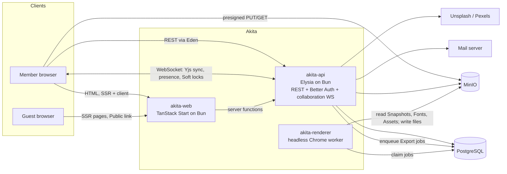
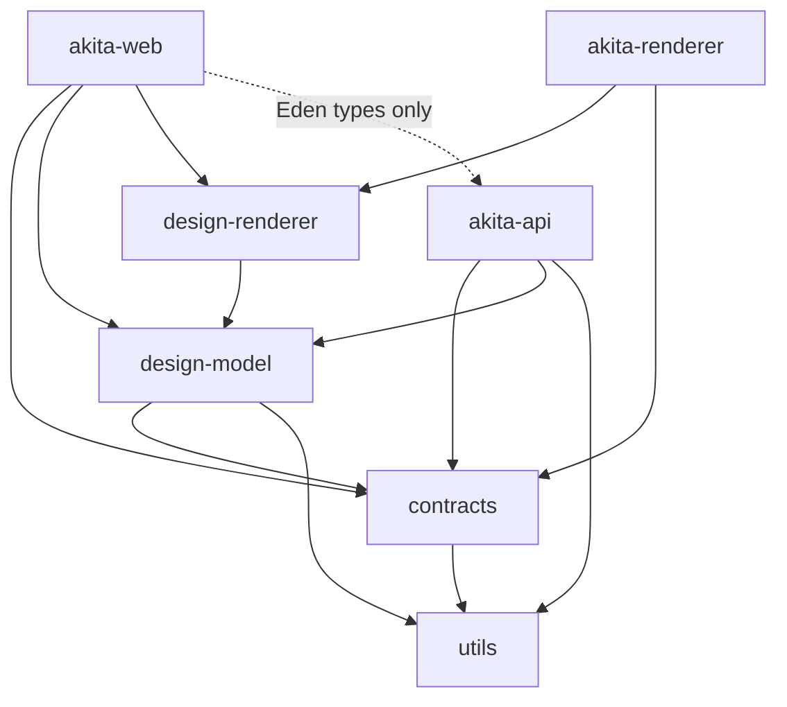
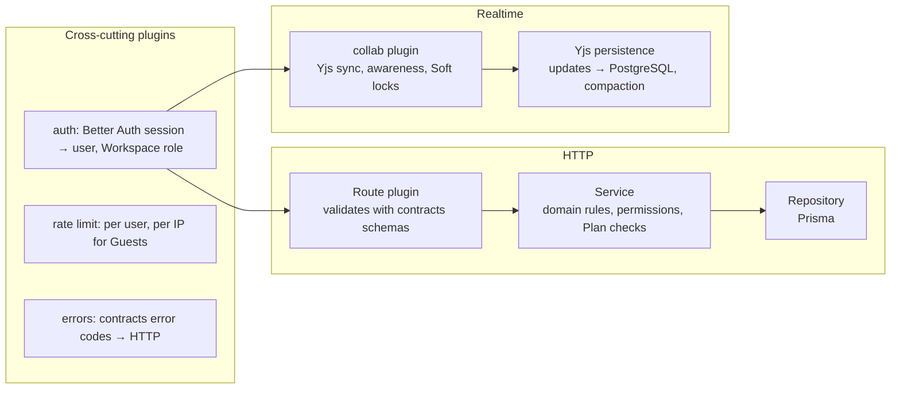
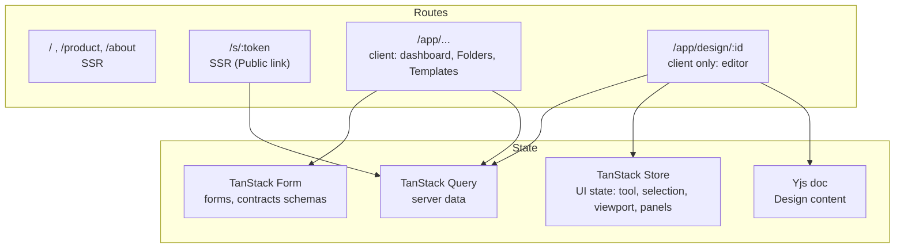
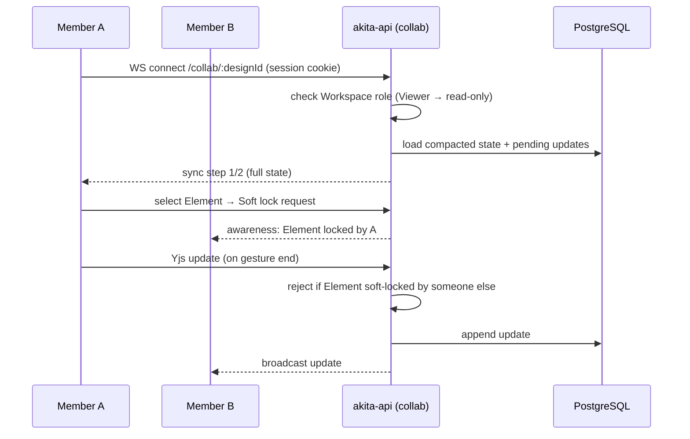
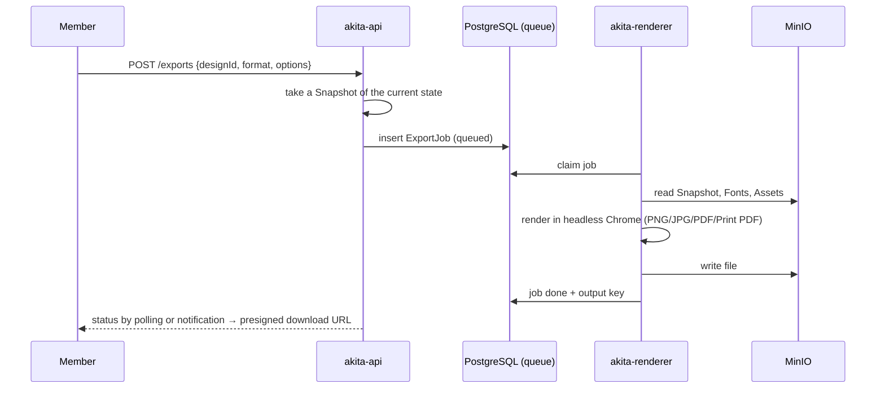
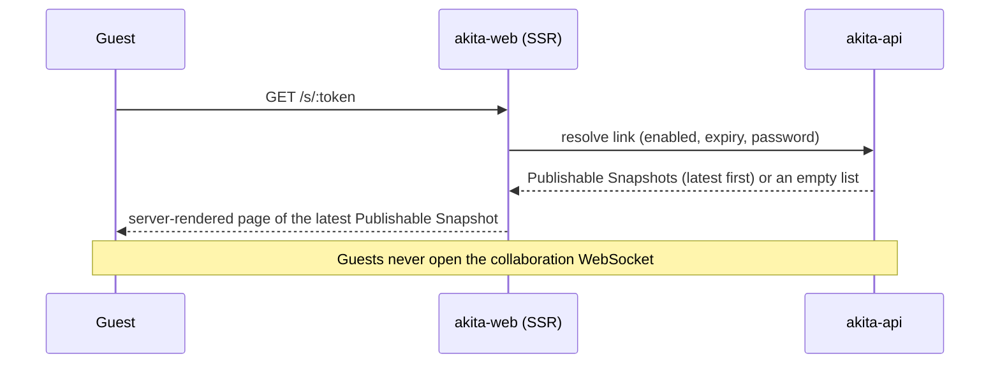

# Architecture

This document explains how Akita is put together. It uses the terms defined in [CONTEXT.md](../CONTEXT.md), the stack in [TECH-STACK.md](TECH-STACK.md), the decisions in [adr/](adr/) and the tables in [DATABASE.md](DATABASE.md).

## 1. System



| Unit | Responsibility |
|---|---|
| **akita-web** | Server-renders public pages (home, product, about) and the Public link view. Serves the editor as a client-only single-page app. Talks to the API through a typed Eden client. |
| **akita-api** | The single backend process: REST, Better Auth, Plan checks, rate limiting, and the collaboration WebSocket. It is the only component that writes to the database. |
| **akita-renderer** | Claims Export jobs, renders Snapshots with the shared Design renderer in headless Chrome, and writes the files to MinIO. Runs on Bun, falling back to Node if Chrome automation misbehaves under Bun. |
| **PostgreSQL** | Relational data, Yjs update logs and the job queue. |
| **MinIO** | Assets, Fonts, Snapshots, Template versions, thumbnails and Export files. |

## 2. Project structure

```
akita/
├── apps/
│   ├── akita-web/          TanStack Start app (public pages + editor)
│   ├── akita-api/          Elysia API, Better Auth, collaboration WebSocket
│   └── akita-renderer/     Export worker (headless Chrome)
├── packages/
│   ├── contracts/          @repo/contracts: constants, Zod schemas, API types, Plan entitlements
│   ├── utils/              @repo/utils: pure helpers (units, colors, ids, dates)
│   ├── design-model/       @repo/design-model: Design document on Yjs, operations, rules
│   ├── design-renderer/    @repo/design-renderer: React renderer, Design state → DOM
│   └── biome-config/       shared Biome config
├── docs/                   TECH-STACK, ARCHITECTURE, DATABASE, adr/, research/, agents/
├── CONTEXT.md              domain glossary
└── DESIGN.md               design system
```

### Package dependencies



Rules:
- Packages never import from apps.
- `contracts` depends only on Zod and `utils`.
- `design-model` has no React code; `design-renderer` has no network code.
- The web app imports the API's **types** only, never its runtime code.

## 3. Backend (akita-api)



- **One Elysia plugin per feature:** auth, workspaces, folders, designs, snapshots, public-links, comments, notifications, assets, fonts, stock, templates, exports, plans. Each plugin owns its routes, service and repository.
- **Validation:** Elysia validates requests with the Zod schemas from `contracts`, through its Standard Schema support. Response types come from the same schemas, so Eden stays in sync.
- **Permissions:** checked in services from the caller's Workspace role. Routes never query the database directly.
- **Background jobs:** a Postgres-backed queue handles Export jobs, the Trash and Snapshot purges, Invitation expiry and the notification email summary.

## 4. Frontend (akita-web)



Folder layout inside `src/`:
- `routes/`: file-based routes, kept thin.
- `features/<feature>/`: components, queries and forms for each feature, for example `features/workspaces`.
- `editor/`: the stage, tools, panels, Layers panel, and the Moveable, Selecto and Tiptap adapters.
- `components/ui/`: shadcn/ui components, styled by [DESIGN.md](../DESIGN.md).
- `integrations/`: the Better Auth client, the Eden client and the Query client.

State rules:
- Design content changes only through `design-model` operations on the Yjs doc.
- TanStack Store never holds a copy of Design content.
- While dragging or transforming, the editor updates the DOM directly and commits to Yjs once when the gesture ends.

## 5. Key flows

### Open a Design and co-edit



### Export



### Guest opens a Public link



## 6. Cross-cutting concerns

| Concern | Approach |
|---|---|
| Auth | Better Auth in the API, with magic link, Google, and the organization plugin for Workspaces. The same session cookie covers REST and WebSocket. |
| Authorization | Workspace role checks in services. Viewers get read-only collaboration. Guests only reach the Public link endpoints. |
| Plans | Entitlements are defined in `contracts`, checked in services and shown in the UI. |
| i18n | Paraglide messages in six languages. The UI language also sets the default Text language. |
| Uploads | The API issues presigned PUT URLs; the browser uploads straight to MinIO; the API records the metadata. |
| Rendering parity | The editor, Public link view and renderer all use `design-renderer` with the same Fonts from MinIO. |
| Testing | `bun test` covers `design-model`, the API end to end (real PostgreSQL and MinIO) and collaboration with simulated clients. Playwright runs under Node for the browser journeys. |
| Local development | Docker Compose for PostgreSQL, MinIO and Mailpit. Everything else runs with `bun run dev`. |
