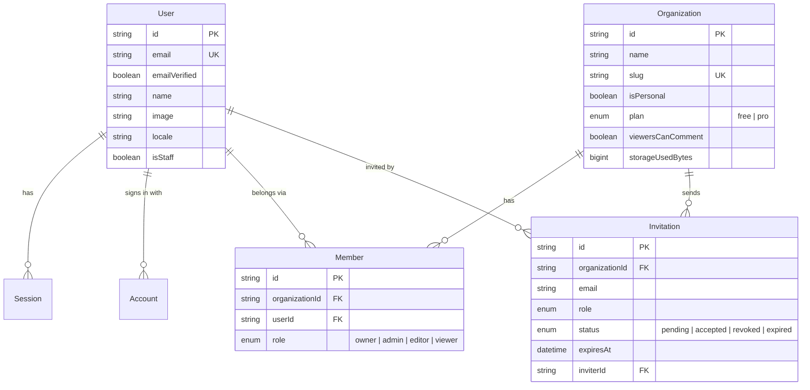
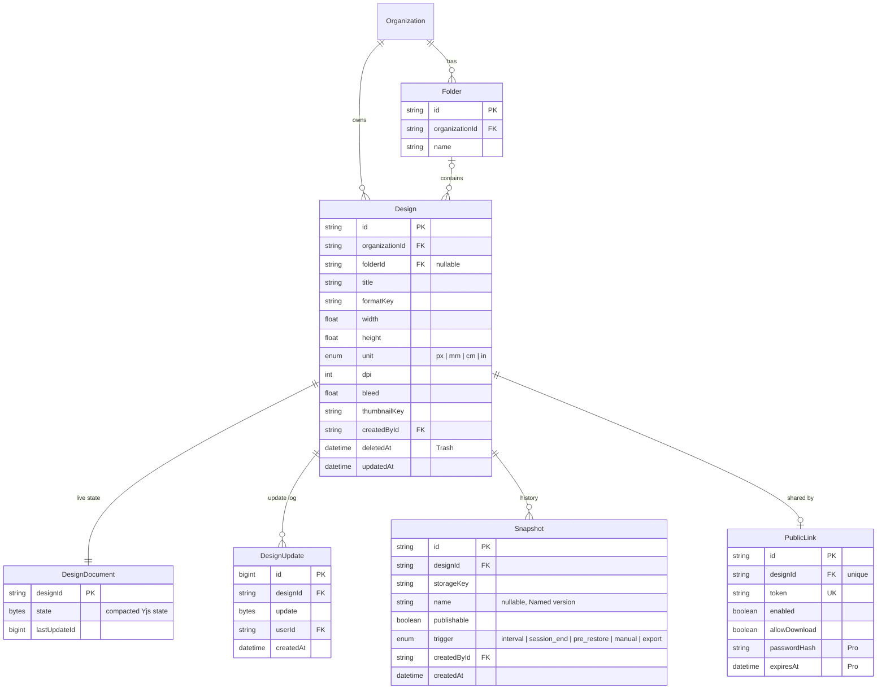
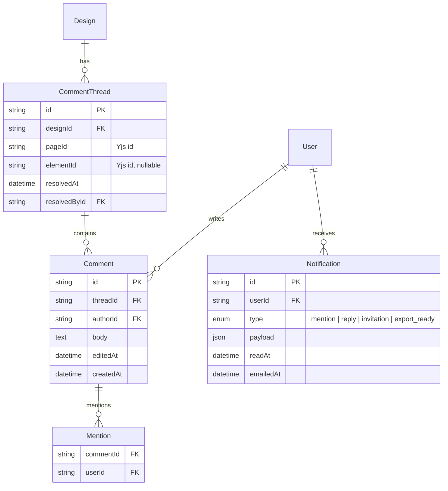
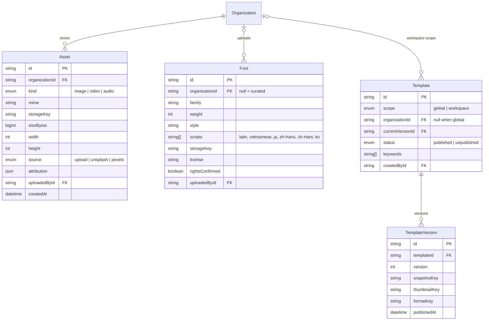
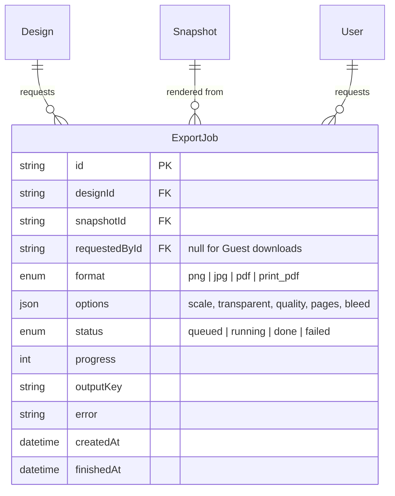

# Database

This document describes the data model: PostgreSQL through Prisma. Terms follow [CONTEXT.md](../CONTEXT.md), and system context is in [ARCHITECTURE.md](ARCHITECTURE.md).

## Principles

- **Design content is not stored in tables.** Pages, Elements and Backgrounds live in each Design's Yjs document (ADR 0001). PostgreSQL stores the Yjs update log and a compacted state. A few fields (title, Format, thumbnail) are mirrored on `Design` for listing and search.
- **Large binaries live in MinIO.** Tables hold only object keys: Snapshots, Assets, Fonts, thumbnails and Export files.
- **Better Auth owns identity tables.** `User`, `Session`, `Account` and `Verification` come from Better Auth, and `Organization`, `Member` and `Invitation` from its organization plugin. In code and in the UI, an organization is called a **Workspace**.
- IDs are `cuid2` strings. Timestamps are `timestamptz`. Deletion is soft only where the glossary requires it (Trash).

## 1. Identity and Workspaces

- `Organization` is the **Workspace**. `plan`, `isPersonal`, `viewersCanComment` and `storageUsedBytes` are extra fields on the Better Auth model.
- There is exactly one `owner` Member per Workspace, enforced in the service layer.
- `Session`, `Account` and `Verification` follow Better Auth's schema unchanged. Magic links use `Verification`, and Google uses `Account`.

## 2. Designs and history

- **Yjs persistence:** the collaboration server appends each update to `DesignUpdate`. A compaction job folds old updates into `DesignDocument.state` and deletes them.
- **Constraints:**
  - `CHECK (publishable = false OR name IS NOT NULL)`: only Named versions can be publishable.
  - A Named version is a `Snapshot` with a `name`; there is no separate table.
- **Retention:**
  - Unnamed Snapshots older than 30 days are deleted, together with their MinIO objects.
  - Designs with `deletedAt` older than 30 days are deleted, which cascades to their Snapshots, Comments and Public link.
- **Indexes:**
  - `Design(organizationId, deletedAt, updatedAt DESC)`
  - `Design(folderId)`
  - trigram index on `Design.title` for search
  - `DesignUpdate(designId, id)`
  - `Snapshot(designId, createdAt DESC)`
  - partial index `Snapshot(designId) WHERE publishable`

## 3. Collaboration

- `pageId` and `elementId` are IDs from the Yjs document. If an Element is deleted, its thread stays and is shown as attached to the Page.
- Presence and Soft locks are **not persisted**. They live only in the collaboration server's awareness state.
- The email summary job sends Notifications where `emailedAt IS NULL`.

## 4. Content

- **Text in a Design references Fonts by ID** inside the Yjs document. Copying a Design to another Workspace copies the referenced Asset and Font rows and their MinIO objects.
- **Plan limits:**
  - At most 10 custom `Font` rows per Workspace on the free Plan.
  - `storageUsedBytes` on the Workspace is updated whenever an `Asset` or `Font` is created or deleted.
- **Keywords** are stored as a `text[]` with a GIN index. Keyword search does not depend on language.
- **Templates:** creating a Design from a Template copies `TemplateVersion.snapshotKey` into a new Design. Existing Designs never change when a Template changes.

## 5. Output and jobs

- **The job queue** lives in its own PostgreSQL schema, managed by the queue library. `ExportJob` is the table users see, and it stores the job's status and result.
- **Scheduled jobs:**
  - Snapshot purge
  - Trash purge
  - Invitation expiry
  - Yjs compaction
  - notification email summary
  - deleting Export files older than 7 days

## Migrations

- Prisma Migrate. Better Auth's schema is generated into the same Prisma schema with its CLI.
- Migrations run in CI and at deploy time, never at app startup.
- The API's end-to-end tests run migrations against a fresh PostgreSQL container.
